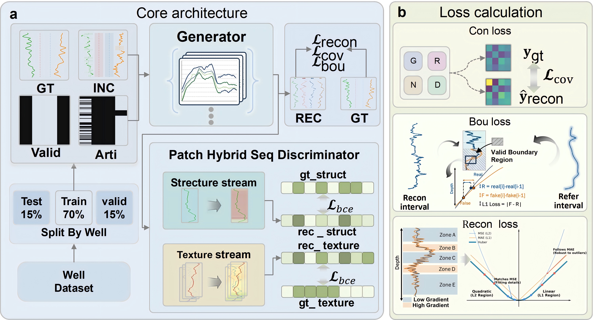
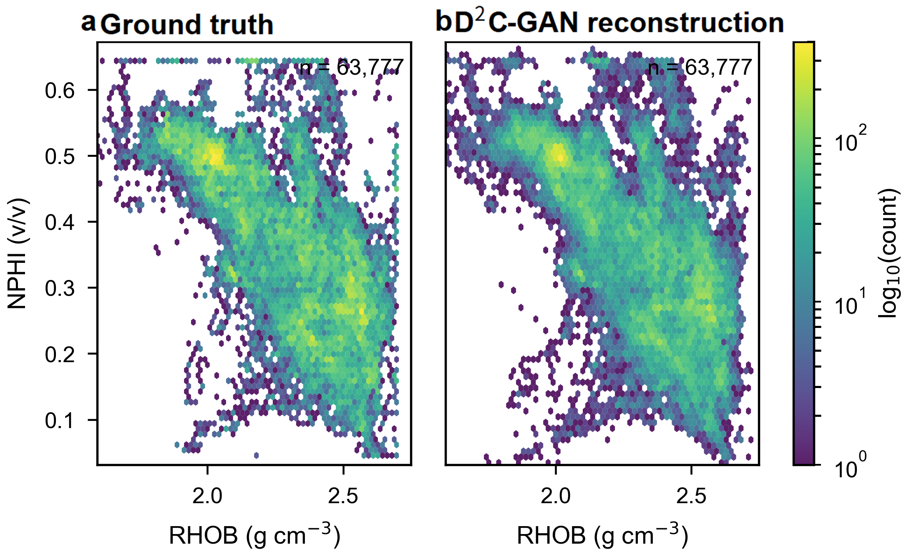
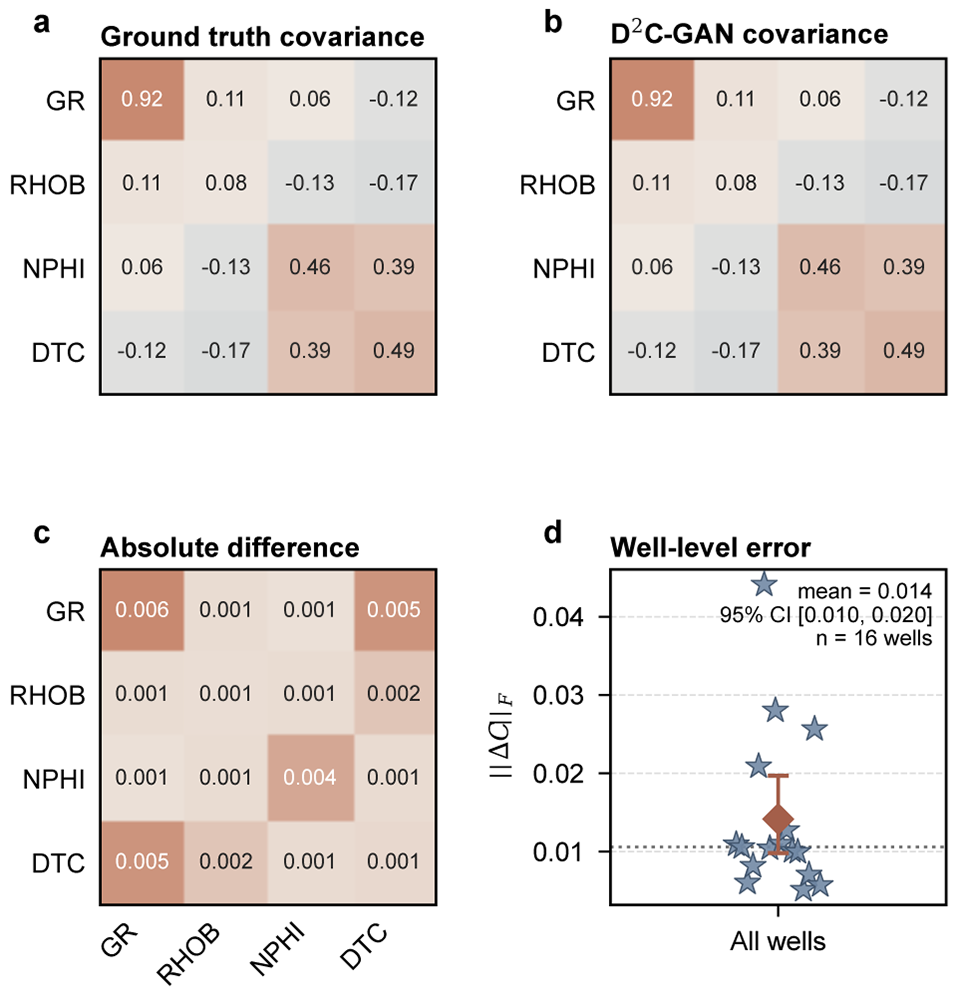
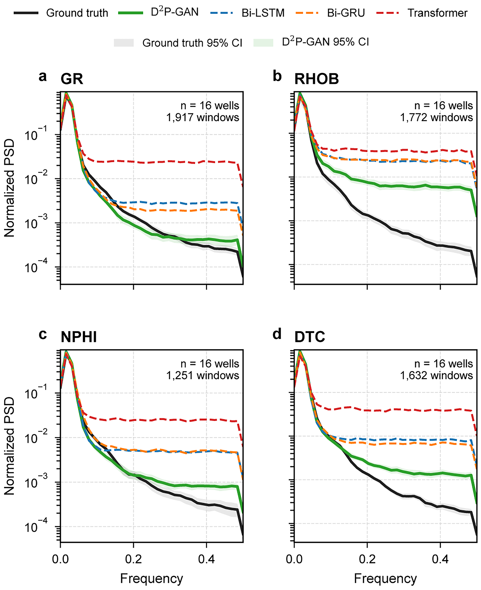

# D2C-GAN

[English](README.md) | 中文

## 发布版本修正（2026-10-01）

默认生成器已改为与原 `Ours_Full` 检查点参数结构匹配的版本：五个时频并行块＋学习式二路 Softmax 融合。提交 `93b2e61` 中的串联生成器移至 `models/legacy_generator.py`，不与这批原权重兼容。

输入仍是四通道零填充测量值，`mask` 参数未参与模型计算；训练保留恢复出的“逐曲线均值＋成对重叠计数”协方差公式。共同四曲线样本协方差用于诊断，不是已核实的训练损失。历史测试掩码是逐点随机，并非连续块。详见[版本来源及剩余限制](docs/RELEASE_CORRECTION.md)。

<p align="center">
  
</p>

<p align="center"><em>历史稿件示意图；实际实现及差异以上述版本说明为准。</em></p>

| 任务 | 目标曲线 | 缺失率评价 | 主要指标 |
| --- | --- | --- | --- |
| 多变量测井曲线重建 | GR、RHOB、NPHI、DTC | 20%、40%、60%、80% | RMSE、MAE、R²、PCC |

## 项目概述

D2C-GAN 是一个面向多变量缺失测井曲线重建的结构化对抗生成框架。当前实现重建四条常用测井曲线：自然伽马（GR）、体积密度（RHOB）、中子孔隙度（NPHI）和压缩波时差（DTC）。

配套论文研究了人工缺失条件下的测井重建问题，重点关注三个方面：恢复缺失位置的数值、保持长深度序列的局部形态，以及维持不同测井曲线之间的统计依赖关系。本仓库包含模型源码、评价脚本，以及论文中用于生成和核查结果的图表源数据与汇总指标。

## 模型设计

实现主要由以下几个部分组成：

- 四通道零填充序列生成器：五个时频并行块，膨胀率为 1、2、4、8、16。
- 每个并行块把同一输入分别送入时域残差分支与傅里叶分支，再用依赖输入的二路 Softmax 权重融合。
- Patch Hybrid Sequence Discriminator：包含结构流和纹理流，对重建的多变量序列以及 GR 纹理分支进行不同层次的判别。
- 复合生成器目标：结合点值重建、跨曲线协方差一致性和相邻差分正则化。其中，相邻差分正则化用于匹配边界变化并抑制不必要的局部波动。

这些设计使重建质量不仅由点值误差决定，也受到深度方向信号结构和跨曲线关系的共同约束。

## 仓库范围

本仓库包含：

- D2C-GAN 生成器和判别器源码；
- 训练脚本和协方差版本配置文件；
- 论文风格的评价脚本；
- 论文图件、精简图源数据和汇总指标；
- 与图表诊断和外部验证相关的实验日志。

仓库不包含原始测井文件、基线模型实现和训练权重。仓库中的结果文件来自论文所报告的分析，不能替代原始井数据。训练权重单独分发，详见 [`weights/README.md`](weights/README.md)。

## 仓库结构

```text
models/
  generator.py              # 序列生成器和频域特征模块
  discriminator.py          # 结构流/纹理流 PatchGAN 判别器
training/
  train_d2cgan.py           # 数据集封装、损失和训练循环
config.py                   # 协方差版本模型和训练设置
evaluate_d2cgan.py         # 论文风格 RMSE/R² 评价脚本
results/
  figures/                  # 论文图件和精简图源数据
  metrics/                  # 汇总指标和 bootstrap 文件
  external_validation/      # 独立盆地验证汇总文件
  logs/                     # 图表和诊断实验记录
weights/
  README.md                 # 外部权重说明
```

## 安装

Python 依赖列在 [`requirements.txt`](requirements.txt) 中。在仓库根目录执行：

```bash
pip install -r requirements.txt
```

实现基于 PyTorch。检测到 CUDA 时会自动使用 GPU，否则使用 CPU。

## 数据和配置

`config.py` 默认从 `data/` 目录读取处理后的 CSV 文件和标准化对象：

```text
data/
  train_processed.csv
  val_processed.csv
  test_processed.csv
  scaler.pkl
```

输入字段由 `well_column`、`depth_column` 和 `feature_names` 控制。运行训练或评价前，请将本地数据和匹配的标准化文件放到相应路径，或在 `config.py` 中修改路径。当前配置使用长度为 80 的序列窗口，并以 GR、RHOB、NPHI 和 DTC 作为目标曲线。

## 数据获取

用于本地复现的处理后数据包和补充文件存放在以下 Google Drive 文件夹中：

[下载数据包](https://drive.google.com/drive/folders/1XsrKaCukW5QAogkL4Q-tAn4qOZbPgRLZ?usp=drive_link)

如果无法打开链接，请将文件夹共享权限设置为“知道链接的任何人可查看”。原始数据集仍需遵守各自来源的许可和署名要求。

## 模型训练

准备好本地数据和标准化文件后，执行：

```bash
python training/train_d2cgan.py
```

训练脚本会构造按井组织的数据集，实例化生成器和 Patch Hybrid Sequence Discriminator，计算验证集重建损失，并在启用早停时保存验证表现最好的生成器权重。

协方差版本由 `config.py` 中的 `weight_petro` 控制。同一配置文件还提供频域模块、膨胀卷积和 CBAM 开关，可用于组件消融实验。

## 模型评价

`evaluate_d2cgan.py` 保留为旧的“整表分块＋逐点随机”评价工具，不强制井边界，也不是连续块测试。权重加载已改为严格匹配；不能再用部分加载掩盖模型版本不兼容。

另外加入经核查的按井外部评价入口：

```bash
python evaluation/external_espirito_santo.py --data-file path/to/external.csv --checkpoint path/to/best_model.pth --scaler path/to/std_scaler.pkl --output external_outputs --model-variant covariance-matching-original
```

该入口采用井内非重叠 80 点窗口、逐点随机掩码和 pooled RMSE/MAE/R²/PCC。外部 CSV 字段及单位转换以脚本定义为准。此次移植未重算已有论文结果。

检查原权重兼容性、运行回归测试：

```bash
python scripts/check_checkpoint.py path/to/best_model.pth
python -m unittest discover -s tests -v
```

`evaluate_d2cgan.py` 会加载生成器权重和标准化器，在 20%、40%、60% 和 80% 缺失率下评价四条目标曲线。脚本输出每条曲线的 RMSE 和 R²，并可以生成深度曲线可视化。将权重和标准化器放到 `config.py` 指定的位置后执行：

```bash
python evaluate_d2cgan.py
```

论文中报告的评价指标包括 RMSE、MAE、R² 和 PCC。`results/` 目录保存了论文级汇总结果、图表源数据和外部井级指标。

## 论文结果文件

| 论文材料 | 仓库位置 |
| --- | --- |
| 图 1–7 | `results/figures/` |
| 协方差和交会图诊断 | `results/figures/` |
| PSD 频谱对比汇总 | `results/figures/` |
| Espírito Santo 独立盆地评价 | `results/external_validation/` |
| 井级 bootstrap 汇总 | `results/metrics/` |
| 图表生成和诊断记录 | `results/logs/` |

外部验证文件保存的是冻结协方差版本 D2C-GAN 的汇总输出，不包含外部盆地的原始测井文件。

### 代表性结果图

下面展示论文中使用的部分结果图：

<p align="center">
  
</p>
<p align="center"><em>测井曲线重建示例。</em></p>

<table>
  <tr>
    <td align="center"><br><sub>跨曲线分布</sub></td>
    <td align="center"><br><sub>协方差诊断</sub></td>
    <td align="center"><br><sub>PSD 诊断</sub></td>
  </tr>
</table>

图源数据和精简数值汇总与图片一起保存在 [`results/figures/`](results/figures/) 目录中。

## 引用

如果使用本仓库中的实现或派生结果文件，请引用配套论文，并注明本代码仓库：

```text
D2C-GAN: structured adversarial reconstruction of incomplete multivariate
well logs. Source code and paper-level results:
https://github.com/FringeOrbit/D2C-GAN
```

## 许可与使用

再次分发数据或派生材料前，请确认本仓库许可证以及原始数据来源的使用条款。本仓库中的结果文件用于支持论文分析结果的检查和复现。
